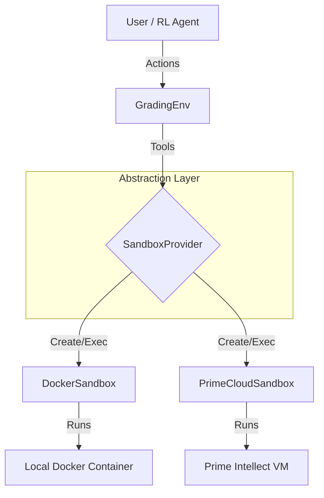

# RL Environment for Educational Grading (AQ3)

This repository implements a modular Reinforcement Learning (RL) environment for automating complex educational grading tasks. It is built on top of the **Prime Intellect Verifiers** library and features a backend-agnostic design.

## 🏗 Architecture

The core of this solution is the `SandboxProvider` abstraction (`src/interfaces.py`). This design pattern decouples the _logic_ of the RL environment from the _execution backend_, allowing seamless switching between:

1.  **Local Docker**: For private, self-hosted training loops (Cost-effective, secure).
2.  **Prime Intellect Cloud**: For managed, scalable rollouts (Easy to scale).

### System Diagram



### Class Structure

- **`GradingEnv` (in `src/env.py`)**: Inherits from `verifiers.StatefulToolEnv`. It defines the tools available to the agent (`read_submission`, `write_feedback`) but delegates execution to the provider.
- **`GradingAgent` (in `src/agent.py`)**: An expert demonstration agent powered by GPT-4o. It generates a "Golden Trajectory" by following a strict rubric, enforcing lateness penalties, and generating class-wide reports.
- **`EvaluationSuite` (in `src/evaluators.py`)**: A plug-and-play verifier that calculates a success score (0.0 - 1.0) based on:
  - **Trajectory**: Did the agent actually read the files before grading?
  - **Outcome**: Did it generate the feedback files and final report?
  - **Policy**: Did it correctly apply the lateness penalty logic?

---

## 🎥 Video Demo

[Watch the Demo Video](https://example.com/demo_video_link)

---

## 🚀 Setup

### 1. Prerequisites

- Python 3.10+
- Docker Desktop (installed and running)
- OpenAI API Key (required for the `main.py` demonstration agent)
- Prime Intellect API Key (optional, for cloud backend)

### 2. Installation

```bash
pip install -r requirements.txt
```

### 3. Configuration

Create a `.env` file in the project root:

```ini
# Options: 'local' (Docker) or 'prime' (Cloud Sandboxes)
SANDBOX_PROVIDER=local

# Required for the Teacher Agent (main.py)
OPENAI_API_KEY=sk-proj-....

# Required if using SANDBOX_PROVIDER=prime or running rollout.py on the cluster
PRIME_API_KEY=pi_....
```

### 4. Data Preparation

Download the AQ3 dataset. This command will download the raw `.docx` files, which the environment automatically converts to text during ingestion.

```bash
# Ensure you are in the project root
gdown --folder "https://drive.google.com/drive/folders/1DGJdchT9KCU2-BznkTYIsgEfYMtdWZPN?usp=sharing" -O data
```

---

## 🏃 Workflow 1: The "Golden Trajectory" (Demo)

Run the environment with a high-intelligence agent (GPT-4o) to demonstrate the ideal grading workflow.

### A. Run Locally (Docker)

Ensure `SANDBOX_PROVIDER=local` is in your `.env`.

```bash
python main.py
```

**What happens:**

1.  Starts a local Docker container.
2.  Converts and uploads student essays to the container.
3.  Agent reads essays, calculates lateness penalties (14/11 deadline), and writes feedback.
4.  Agent generates `final_report.md`.
5.  Results are downloaded to the `results/` folder.

### B. Run on Cloud (Prime Intellect)

To verify cloud compatibility without changing code:

1.  Change `.env` to `SANDBOX_PROVIDER=prime`.
2.  Run `python main.py` again.
3.  Observe the logs provisioning a remote VM (`[Cloud] Requesting Prime Intellect Sandbox...`).

---

## 🧪 Workflow 2: "Lab-Scale" RL Training

This workflow demonstrates how a Frontier Lab would use this environment to train an open-source model (e.g., Qwen-7B) on a GPU cluster.

### 1. Local Mock Run (CPU)

Verify the training loop works on your laptop before renting a GPU.

- _Note: This uses a "Mock LLM" to simulate the GPU part._

```bash
# Ensure SANDBOX_PROVIDER=local
python rollout.py
```

### 2. Production Run (H100 GPU)

Deploy the environment to a Prime Intellect H100 node. The H100 acts as the "Learner," spawning remote sandboxes for execution.

**Build & Push Image:**

```bash
docker login
docker build -t yourusername/grading-rl-env:v1 -f Dockerfile.cloud .
docker push yourusername/grading-rl-env:v1
```

**Launch Pod:**

```bash
# Update pod.yaml with your API key first, or use environment variable substitution
prime pods create -f pod.yaml
```

**Monitor:**

```bash
prime pods list
prime pods logs <POD_ID>
```

You will see the H100 loading `Qwen2.5-7B` and generating actions against the Prime Cloud Sandboxes.

---

## 📂 Project Structure

```text
educational-rl-env/
├── main.py                 # Entry point for GPT-4o Demo
├── rollout.py              # Entry point for H100/RL Training
├── src/
│   ├── agent.py            # The Teacher Agent logic
│   ├── config.py           # Configuration & Constants
│   ├── data_gen.py         # Data ingestion & docx conversion
│   ├── env.py              # The Verifiers Environment definition
│   ├── evaluators.py       # Scoring logic (Reward Function)
│   ├── interfaces.py       # SandboxProvider Abstract Base Class
│   ├── prompts.py          # Externalized Prompts
│   └── providers/
│       ├── docker_sandbox.py # Local implementation
│       └── prime_sandbox.py  # Cloud implementation
├── tests/                  # Integration & Unit Tests
├── Dockerfile.cloud        # For building the H100 image
└── requirements.txt        # Dependencies
```
